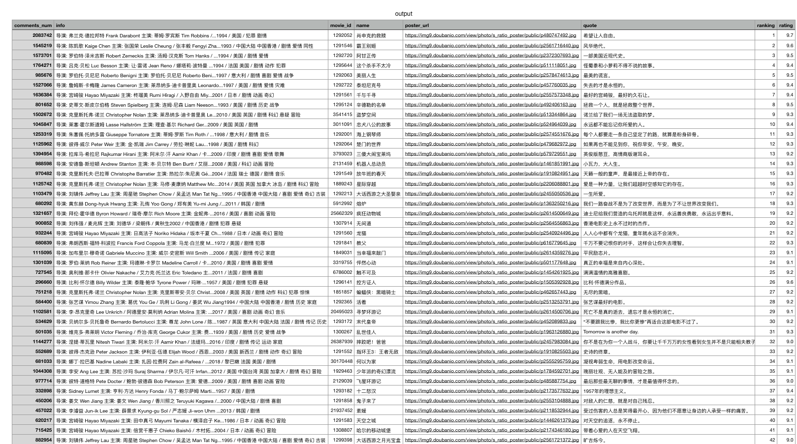

# 基于Scrapy爬取豆瓣电影榜单Top250

## 零. 目标
利用Scrapy框架对豆瓣电影榜单Top250中的的电影信息`[排名，电影豆瓣ID，电影名，简介，评分，评论数，摘引，海报图片略缩图地址]`进行抓取，并保存成`.csv`文件


## 壹. Scrapy的工作原理

**[Scrapy](https://scrapy.org/)**是一个开源的爬虫应用框架，用于以快速，简单但可扩展的方式从网站提取结构性数据。可以应用在包括数据挖掘，信息处理或存储历史数据等一系列的程序中。一个Scrapy项目的组成结构如下图展示


- **引擎(Scrapy Engine)**，用来处理整个系统的数据流处理，触发事务。
- **调度器(Scheduler)**，用来接受引擎发过来的请求，压入队列中，并在引擎再次请求的时候返回。
- **下载器(Downloader)**，用于下载网页内容，并将网页内容返回给蜘蛛。
- **蜘蛛(Spiders)**，蜘蛛是主要干活的，用它来制订特定域名或网页的解析规则。编写用于分析response并提取item(即获取到的item)或额外跟进的URL的类。 每个spider负责处理一个特定(或一些)网站。
- **项目管道(Item Pipeline)**，负责处理有蜘蛛从网页中抽取的项目，他的主要任务是清晰、验证和存储数据。当页面被蜘蛛解析后，将被发送到项目管道，并经过几个特定的次序处理数据。
- **下载器中间件(Downloader Middlewares)**，位于Scrapy引擎和下载器之间的钩子框架，主要是处理Scrapy引擎与下载器之间的请求及响应。
- **蜘蛛中间件(Spider Middlewares)**，介于Scrapy引擎和蜘蛛之间的钩子框架，主要工作是处理蜘蛛的响应输入和请求输出。

爬取流程如上图红线所展示，首先从请求初始URL开始，Scheduler会将其交给Downloader进行下载，下载之后会交给Spider进行分析，Spider分析出来的结果有两种：一种是需要进一步抓取的链接，例如之前分析的“下一页”的链接，这些东西会被传回Scheduler；另一种是需要保存的数据，它们则被送到Item Pipeline那里，那是对数据进行后期处理(详细分析、过滤、存储等)的地方。另外，在数据流动的通道里还可以安装各种中间件，进行必要的处理。

更多关于Scrapy的安装，操作，或者技术细节请参考[官方文档](https://docs.scrapy.org/en/latest/#)，文档中还有一个[简单的实例](https://docs.scrapy.org/en/latest/intro/examples.html)。

## 贰. 新建Scrapy项目

在开始之前，我们需要新建一个Scrapy项目，使用命令行`scrapy startproject <项目名称>`，会在当前目录下生成一个`<项目名称>`文件夹并自动生成一个Scrapy项目所需的文件。以该项目为例，我们可以运行：

```
scrapy startproject doubanmovietop250
```

生成的目录结构如下：

```
.
├── doubanmovietop250     # project's Python module, you'll import your code from here
│   ├── __init__.py
│   ├── items.py          # project items definition file
│   ├── middlewares.py    # project middlewares file
│   ├── pipelines.py      # project pipelines file
│   ├── settings.py       # project settings file
│   └── spiders           # a directory where you'll later put your spiders
│       └── __init__.py
└── scrapy.cfg            # deploy configuration file
```

然后可以用`cd doubanmovietop250`和`cd spiders`进入`spiders`目录。在该目录下运行`scrapy genspider <爬虫名> <域名>`，就会生成爬虫文件`<爬虫名>.py`。以该项目为例，我们可以运行：

```
scrapy genspider movie movie.douban.com
```

生成的代码如下：

```python
# ./doubanmovietop250/spiders/movie.py
import scrapy


class MovieSpider(scrapy.Spider):
    name = 'movie'
    allowed_domains = ['movie.douban.com']
    start_urls = ['http://movie.douban.com/']

    def parse(self, response):
        pass
        
```

> 注意：爬虫会自动过滤掉`allowed_domains`之外的域名，因此需要注意这个变量的赋值

## 叁. 定义数据内容并设置网络代理

需要爬取的豆瓣电影榜单的URL为https://movie.douban.com/top250，以《肖申克的救赎》为例


我们要爬取的电影信息有`[排名，电影豆瓣ID，电影名，简介，评分，评论数，摘引，海报图片略缩图地址]`，因此需要在`items.py`文件中先定义这几个对象：

```python
# ./doubanmovietop250/items.py
import scrapy


class Doubanmovietop250Item(scrapy.Item):
    ranking = scrapy.Field()        # 排名
    movie_id = scrapy.Field()       # 电影豆瓣ID
    name = scrapy.Field()           # 电影名
    info = scrapy.Field()           # 简介
    rating = scrapy.Field()         # 评分
    comments_num = scrapy.Field()   # 评论数
    quote = scrapy.Field()          # 摘引
    poster_url = scrapy.Field()     # 海报图片略缩图地址
    pass
```

在进行数据爬取之前首先要设置用户代理，在`settings.py`文件内找到并取消注释`USER_AGENT`变量，可以按照自己的用户代理进行设置。我在此处修改如下：

```python
# ./doubanmovietop250/settings.py
# Crawl responsibly by identifying yourself (and your website) on the user-agent
USER_AGENT = 'Mozilla/5.0 (Macintosh; Intel Mac OS X 10_15_6) AppleWebKit/537.36 (KHTML, like Gecko) Chrome/83.0.4103.116 Safari/537.36'
```

如何通过对下载中间件进行伪装，利用IP池或UA池来应对网站的反爬虫机制将在 **陆. 中间件设置** 中提及。

## 肆. 爬虫的编写及数据爬取

现在我们可以回到`spiders`目录下，打开在 **贰. 新建Scrapy项目** 中生成的`movie.py`文件，并对我们的爬虫做一些修改。`movie.py`中包含了自动创建的三个变量和一个方法，在parse方法中进行返回数据response的处理，我们首先需要在start_urls提供爬虫的入口地址，修改如下:

```python
start_urls = ['https://movie.douban.com/top250']
```

接下来要对网页数据进行筛选，通过Xpath规则可以使我们便捷地选中网页中的指定元素。对网页内容进行分析：一共**250个电影条目**按排名分布在**10页**中，每页包含**25部电影**。

如下图所示，每个电影条目都包裹在`<ol class="grid_view">`下的一个个`<li>`标签里，因此通过XPath: `//ol[@class='grid_view']/li` 可以选中了本页面所有的电影条目。


爬虫返回的response对象有`xpath()`方法，可以直接处理XPath规则字符串并返回对应的页面内容，这些内容都是选择器对象Selector，可以进一步作细化的内容选取，通过XPath选择出其中的`排名，电影豆瓣ID，电影名，简介，评分，评论数，摘引，海报图片略缩图地址`等内容，即之前在`items.py`文件中所定义的数据结构`Doubanmovietop250Item`。循环遍历每个电影列表从其中爬取到准确的电影信息，并保存为对象item，最后通过yield将item对象从Spiders返回到Item管道。

爬虫除了需要从页面提取Item数据之外还还需要形成下一页的Request请求，分析`后页`按钮，如下图所示：


通过XPath: `//span[@class='next']/link`选中`后页`按钮并提取出其`href`值与网站地址`https://movie.douban.com/top250`拼接，就可以得到下一页面的URL地址。如果不为空，则拼接得到的Request请求yield提交给调度器Scheduler。

修改之后，最终的爬虫movie.py文件如下：

```python
# ./doubanmovietop250/spiders/movie.py
import scrapy
from ..items import Doubanmovietop250Item


class MovieSpider(scrapy.Spider):
    name = 'movie'
    allowed_domains = ['movie.douban.com']
    start_urls = ['https://movie.douban.com/top250']

    def parse(self, response):
        # 首先爬取电影列表
        movie_list = response.xpath("//ol[@class='grid_view']/li")
        for selector in movie_list:
            # 遍历电影列表，从每个电影条目中抓取所需要的信息并保存为item对象
            item = Doubanmovietop250Item()

            item['ranking'] = selector.xpath(".//div[@class='pic']/em/text()").extract_first()
            item['movie_id'] = selector.xpath(".//div[@class='pic']/a[1]/@href").extract_first().lstrip('https://movie.douban.com/subject/').rstrip('/')
            item['name'] = selector.xpath(".//span[@class='title']/text()").extract_first()
            text = selector.xpath(".//div[@class='bd']/p[1]/text()").extract()
            info = ""
            for s in text:  # 将简介放到一个字符串
                info += " ".join(s.split())
            item['info'] = info
            item['rating'] = selector.css('.rating_num::text').extract_first()
            item['comments_num'] = selector.xpath(".//div[@class='star']/span[4]/text()").extract_first().rstrip('人评价')
            item['quote'] = selector.xpath(".//span[@class='inq']/text()").extract_first()
            item['poster_url'] = selector.xpath(".//div[@class='pic']/a[1]/img[1]/@src").extract_first()

            yield item  # 将结果item对象返回给Item管道

        # 爬取网页中的下一个页面的url
        next_page = response.xpath("//span[@class='next']/a[1]/@href").extract_first()
        if next_page:
            next_page = "https://movie.douban.com/top250" + next_page
            # 将Request请求提交给调度器
            yield scrapy.Request(next_page, callback=self.parse)

```

此时爬虫应该已经可以正常运行了，通过命令行启动这个名为`movie`的爬虫

```
scrapy crawl movie
```

## 伍. 数据保存

在运行爬虫文件时通过参数-o指定文件保存的位置即可，可以根据文件后缀名选择保存为json或者csv文件，例如

```
scrapy crawl movie -o output.csv
```



还可以修改`piplines.py`文件，对取得的Item数据作进一步操作，从而通过python操作将其保存到数据库中。


## 陆. 中间件设置

利用IP池或UA池来应对网站的反爬虫机制非常常见，Scrapy让我们可以通过中间件Middleware的方式来实现代理。此处通过User-Agent列表来进行演示：在middlewares.py文件中新建一个user_agent类用于为请求头添加用户列表，从网上查一些常用的用户代理放入USER_AGENT_LIST列表，然后通过random函数从中随机抽取一个作为代理，设置为reques请求头的User_Agent字段

```python
# ./doubanmovietop250/middleware.py
class UserAgent(object):
    def process_request(self, request, spider):
        USER_AGENT_LIST = [
            'Mozilla/5.0 (Windows NT 6.1; WOW64) AppleWebKit/536.6 (KHTML, like Gecko) Chrome/20.0.1092.0 Safari/536.6',
            'Mozilla/5.0 (Windows NT 10.0; WOW64) AppleWebKit/537.36 (KHTML, like Gecko) Chrome/61.0.3163.79 Safari/537.36 Maxthon/5.2.1.6000',
            'Opera/9.0 (Macintosh; PPC Mac OS X; U; en)',
            'Mozilla/4.0 (compatible; MSIE 7.0; Windows NT 6.1; WOW64; Trident/7.0; SLCC2; .NET CLR 2.0.50727; .NET CLR 3.5.30729; .NET CLR 3.0.30729; .NET4.0C; .NET4.0E)',
            'Mozilla/5.0 (Windows NT 6.1; WOW64) AppleWebKit/537.22 (KHTML, like Gecko) Chrome/25.0.1364.152 Safari/537.22',
            'Mozilla/5.0 (Windows NT 10.0; Win64; x64; rv:59.0) Gecko/20100101 Firefox/59.0',
            'Mozilla/5.0 (Windows NT 6.1; Win64; x64) AppleWebKit/537.36 (KHTML, like Gecko) Chrome/66.0.3359.139 Safari/537.36',
            'Mozilla/5.0 (Windows NT 10.0; WOW64) AppleWebKit/537.36 (KHTML, like Gecko) Chrome/63.0.3239.132 Safari/537.36',
            'Mozilla/5.0 (Macintosh; Intel Mac OS X 10.8; rv:16.0) Gecko/20120813 Firefox/16.0',
            'Mozilla/5.0 (compatible; MSIE 9.0; Windows NT 6.1; WOW64; Trident/5.0)',
            'Mozilla/5.0 (Macintosh; Intel Mac OS X 10_11_4) AppleWebKit/537.36 (KHTML, like Gecko) Chrome/56.0.2924.87 Safari/537.36'
        ]
        agent = random.choice(USER_AGENT_LIST)  # 从上面列表中随机抽取一个代理
        request.headers['User_Agent'] = agent  # 设置请求头的用户代理
```

在settings.py文件内设置开启下载中间件即取消如下几行的注释，注册代理类user_agent并设置优先级，数字越小优先级越高

```python
# ./doubanmovietop250/settings.py
# Enable or disable downloader middlewares
# See https://docs.scrapy.org/en/latest/topics/downloader-middleware.html
DOWNLOADER_MIDDLEWARES = {
    'doubanmovietop250.middlewares.UserAgent': 543,
}
```

